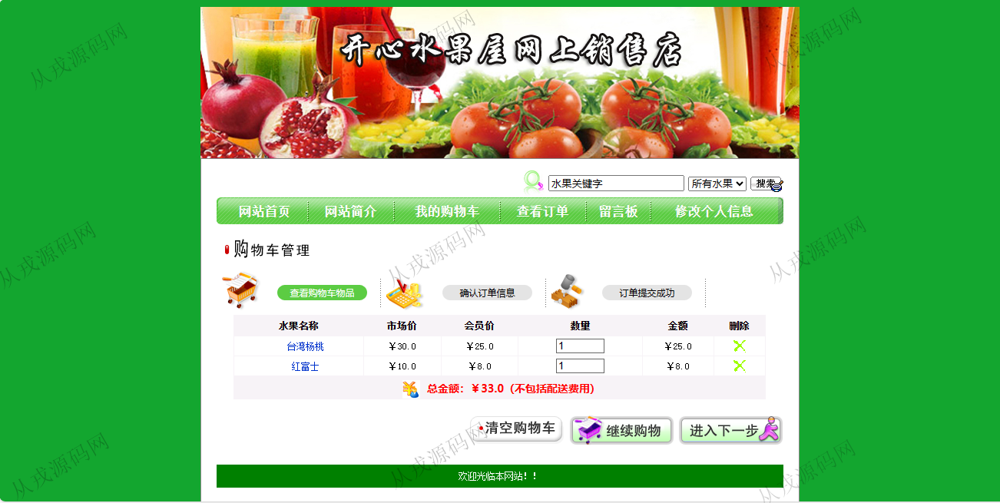

<h1 align="center">119.水果4S店营销管理系统</h1>

- <b>完整代码获取地址：从戎源码网 ([https://armycodes.com/](https://armycodes.com/))</b>
- <b>技术探讨、资料分享，请加QQ群：692619798</b> 
- <b>作者微信：19941326836  QQ：952045282</b> 
- <b>承接计算机毕业设计、Java毕业设计、Python毕业设计、深度学习、机器学习</b>
- <b>选题+开题报告+任务书+程序定制+安装调试+论文+答辩ppt 一条龙服务</b>
- <b>所有选题地址 ([https://github.com/YuLin-Coder/AllProjectCatalog](https://github.com/YuLin-Coder/AllProjectCatalog)) </b>

## 项目介绍
基于ssh的水果4S店营销管理系统【含报告】：前端 jsp、js，后端 struts、hibernate，角色分为管理员、用户；集成水果浏览，购物车，在线购买，我的订单等功能于一体的系统。

## 功能介绍

### 用户

- 基本功能：登录、注册、退出、个人信息查看与修改，密码修改
- 网站首页：主导航栏，水果类别导航，特价区，新品上市，全局搜索
- 水果购买：水果详情页，加入购物车，购物车商品列表，收货地址填写，提交订单
- 我的订单：订单列表查询，订单详情，订单删除
- 留言板：留言列表信息查看，发布新留言

### 管理员

- 水果分类管理：分类信息的增删改查
- 水果管理：水果信息的增删改查，水果图片上传与查看，绑定分类信息
- 特价水果管理：特价水果信息的增删改查，水果图片上传与查看，绑定分类信息
- 订单管理：前台用户提交订单，后台管理员查看订单列表，处理订单，结单或删除订单
- 会员管理：会员信息的列表查询，详情，删除，调整会员级别，会员信息由前台用户自行注册而来
- 系统用户管理：系统用户信息的增删改查
- 留言管理：留言信息的列表查询，详情，删除，留言回复

## 环境

- <b>IntelliJ IDEA 2009.3</b>

- <b>Mysql 5.7.26</b>

- <b>Tomcat 7.0.73</b>

- <b>JDK 1.8</b>

## 运行截图

